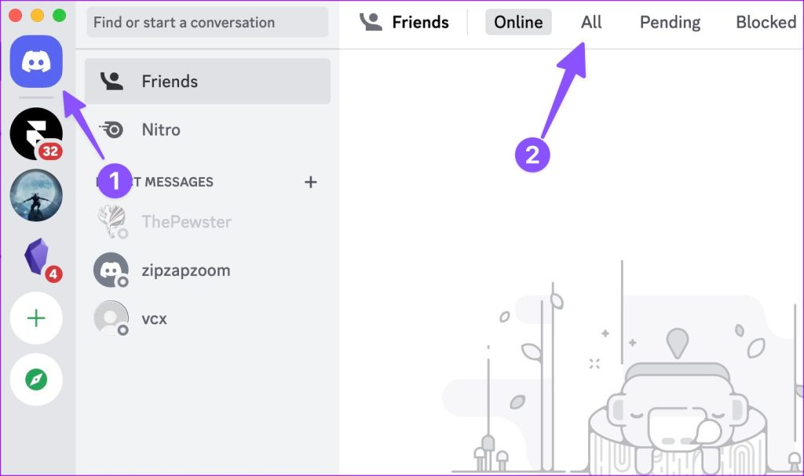

# 🕵 Git Resistance: O Jogo

Damos-te as boas vindas ao teu primeiro HackerWorkshop do teu estágio: **Workshop de Git**! O objetivo é jogar *The Resistence* enquanto aprendes git. Se nunca jogaste *The Resistence*, podes encontrar as regras [aqui](https://cdn.1j1ju.com/medias/1e/da/43-the-resistance-rulebook.pdf), mas a ideia geral do jogo é aprovar 3 missões com sucesso enquanto que os x-biters vão tentar sabotar 3 missões sem serem descobertos.

## 📂 Estrutura do Repositório

  * presencas.md (Ficheiro vazio, será preenchido por todos no final do jogo).

  * missao_01/ ➝ contém equipa_atual.md

  * missao_02/ ➝ contém equipa_atual.md

  * missao_03/ ... (até à missão 5)

## ⚙️ Configuração Inicial (Admin do Repositório)

**Antes do jogo começar, o admin deve:**

1. **Adicionar Participantes:**
   * Adicionar um a um todos os participantes do workshop ao repositório
   * Dar-lhes permissão de escrita (Write access)

2. **Configurar Regras de Votação:**
   * Ir a **Settings > Rules > Rulesets > voting**
   * Em **Require a pull request before merging**, clicar em **Show additional settings**
   * Alterar **Required approvals** para `(número de pessoas / 2) + 1` (maioria de aprovações é suficiente)

3. **Durante o Jogo:**
   * O admin pode passar a fase das votações e fazer merge manualmente da branch na main quando necessário

## 🎭 Descobrir a Tua Identidade

**Por padrão, todos os estagiários são HACKERS (Resistência).**

Apenas os x-biters (impostores) recebem uma mensagem privada no Discord antes do jogo começar.

**Antes de começares a jogar, confirma se não recebeste mensagem privada no Discord:**



-----

## 🔄 O Ciclo de Jogo (Por Ronda)

### 1. A Liderança 👑

  * Toda a gente se reúne em círculo.

  * Um objeto físico (o "Token de Líder") passa de mão em mão para definir a pessoa Líder da ronda atual.

### 2. A Escolha da Equipa (Branch & PR) 🤝

  * A pessoa escolhida como Líder cria uma nova branch localmente (ex: equipa-ronda-1).

  * Edita o ficheiro missao_X/equipa_atual.md e escreve os nomes d@s estagiári@s que quer levar para a missão.

  * Faz *Commit* e *Push*:
    * Na primeira vez que fazes push de uma branch nova, usa: `git push -u origin nome-da-branch`
    * Isto conecta a branch local à remota. Nas próximas vezes podes só fazer `git push`.

  * Abre um *Pull Request (PR)* para a main:
    * Ir a `https://github.com/HackerSchool/HackerWorkshop-Git/tree/branch_correspondente`
    * Clicar no botão **"Compare & pull request"** que aparece

### 3. A Votação Pública (Code Review) 🗳

  * Tod@s vão ao GitHub ver o PR.

  * **Como votar:**
    1. Ir a **Pull Requests** na página de GitHub do repo
    2. Clicar no título do pull request correspondente
    3. Ir a **Commits**
    4. Clicar no último commit feito
    5. Clicar em **Review**
    6. Selecionar **Approve** (para aprovar a equipa) ou **Request Changes** (para recusar a equipa)
    7. Clicar em **Submit review**

  * *Contagem:* O Game Master verifica o PR.

      * Maioria Rejeita: A pessoa Líder fecha o PR. O Token passa para a próxima pessoa.

      * Maioria Aprova: O Game Master faz *Merge* do PR para a main (se tiver maioria isto é feito automaticamente). A missão avança!

### 4. A Missão (Push Anónimo) 🕵‍♂

  * *Apenas* os membros listados no equipa_atual.md jogam nesta fase.

  * Os membros da equipa fazem git pull.

  * *Configuração de Anonimato (OBRIGATÓRIO):*

    Devem correr estes comandos na consola para não serem identificados no histórico:

    **IMPORTANTE:** Não pode haver "xb" ou "hacker" no nome, para não ser identificável. Usa sempre:

    ```bash
    git config --local user.name "anonymous"
    git config --local user.email "anonymous@hackerschool.pt"
    ```

  * *A Ação:*

    Criam um ficheiro novo dentro da pasta da missão com um nome aleatório (ex: voto_a8j2k.md ou voto_19283.md) para evitar conflitos.

  * *O Voto:*

    Dentro desse ficheiro escrevem apenas uma palavra:

      * SUCESSO (Resistência deve votar sempre isto; x-biters podem votar isto para disfarçar).

      * FALHA (Apenas x-biters podem votar isto).

  * *Envio:*

    Fazem git add, git commit e git push.

### 5. O Resultado 📉

  * O Game Master faz git pull na main.

  * Todos abrem a pasta da missão e verificam os ficheiros de voto.

  * Verificam se a missão teve Sucesso (0 falhas\*) ou se Falhou (1 ou mais falhas).

      * (Nota: Na missão 4, são precisas 2 falhas, dependendo se nº de jogadores > 7).

-----

## 🏁 Fim do Jogo & Cleanup

Assim que uma equipa chegar às 3 vitórias:

1.  O jogo termina.

2.  *Exercício Final (Conflitos):* Todos os estagiários devem, ao mesmo tempo, editar o ficheiro presencas.md na raiz, colocar o seu nome real e fazer push.

-----

### 💡 Dicas para o Game Master

  * Garante que ninguém faz git pull durante as missões até todos terem votado, para não verem os votos a chegar um a um.

  * Se alguém se esquecer de mudar o git config, o commit vai aparecer com o nome e foto verdadeiros no GitHub. É "Game Over" para essas pessoas, então é melhor reforçar este ponto.


## Sobre o Git: 


Cheat sheet [aqui](https://training.github.com/downloads/github-git-cheat-sheet.pdf).

### 🚑 Quick Troubleshoot (SOS)

**"Instalei o Git mas o comando não funciona!"**

  * 👉 Reinicia o terminal (fecha e volta a abrir).
  
**"Tento fazer push e dá erro!"**

  * 👉 Provavelmente alguém fez alterações no GitHub que tu não tens. Faz primeiro `git pull` (traz as novidades) e depois tenta de novo.

**"Quando tento fazer push para a minha branch, dá erro tipo 'no upstream branch' ou 'branch diverged'!"**

  * 👉 **Problema:** A tua branch local não está "conectada" (tracking) à branch remota. Isto acontece quando crias uma branch local mas não especificas para onde fazer push.

  * 👉 **Solução:** Na primeira vez que fazes push de uma branch nova, usa o flag `-u` (ou `--set-upstream`):
    ```bash
    git push -u origin nome-da-tua-branch
    ```
    Isto conecta a branch local à remota e nas próximas vezes podes só fazer `git push`.

  * 👉 **Se a branch remota já existe** mas criaste uma nova local sem tracking:
    1. Verifica se a branch remota existe: `git branch -r` (lista branches remotas)
    2. Se existir, conecta a tua branch local: `git branch --set-upstream-to=origin/nome-da-branch nome-da-tua-branch-local`
    3. Ou simplesmente: `git push -u origin nome-da-tua-branch-local`

  * 👉 **Dica:** Quando criares uma branch nova, em vez de `git checkout -b nova-branch`, podes usar:
    ```bash
    git checkout -b nova-branch origin/main  # Cria baseada na main remota
    ```
    Ou se já existe a branch remota:
    ```bash
    git checkout -b nova-branch origin/nova-branch  # Cria local baseada na remota
    ```

**"No Linux, quando tento fazer push pede-me para iniciar sessão constantemente!"**

  * 👉 **Solução Recomendada (Gráfica e Duradoura):** Instala o **Git Credential Manager (GCM)** que permite autenticação através do browser e guarda as credenciais automaticamente:

    **Ubuntu/Debian:**
    ```bash
    sudo apt-get update
    sudo apt-get install git-credential-manager
    git config --global credential.credentialStore cache
    ```

    **Fedora/RHEL:**
    ```bash
    sudo dnf install git-credential-manager
    git config --global credential.credentialStore cache
    ```

    **Arch Linux:**
    ```bash
    sudo pacman -S git-credential-manager
    git config --global credential.credentialStore cache
    ```

    Depois de instalar, na primeira vez que fizeres `git push`, vai abrir o browser para autenticares. As credenciais ficam guardadas e não precisas de fazer isto novamente!

  * 👉 **Alternativa (SSH - Mais Permanente):** Se preferires usar SSH keys (não precisas de autenticar sempre):
    1. Gera uma chave SSH: `ssh-keygen -t ed25519 -C "teu@email.com"` (pressiona Enter para aceitar o caminho padrão)
    2. Adiciona a chave ao ssh-agent: `eval "$(ssh-agent -s)"` e depois `ssh-add ~/.ssh/id_ed25519`
    3. Copia a chave pública: `cat ~/.ssh/id_ed25519.pub` (copia todo o output)
    4. No GitHub: **Settings > SSH and GPG keys > New SSH key** > Cola a chave e guarda
    5. Muda o remote do repo para usar SSH: `git remote set-url origin git@github.com:HackerSchool/HackerWorkshop-Git.git`
